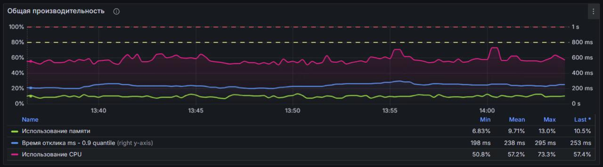

# backend-is-also-beautiful

Материалы для доклада "Backend - это тоже красиво"

### Об авторе

Меня зовут Ваганов Вадим, я руководитель разработки и Head of Profession Backend в Газпромбанке.
Я обожаю делиться опытом, а также обучать и приносить пользу другим. Все мои доклады я строю на своих личных 
историях, так что этот будет таким же. Если тебе понравится доклад и ты захочешь ознакомиться с другим моим 
контентом - приглашаю в [мой телеграм-канал](https://t.me/vaganov_vadim). Погнали!

### Проблема


──────────────────────────────
Доклад: Мониторинг приложений и четыре золотых сигнала. Почему мониторинг — навык будущего инженерии


### 

Картинка для привлечения внимания :)



### Попробовать поиграться локально


```bash
docker compose -f local/docker-compose.yml up
```

```bash
./gradlew bootRun
```

```bash
for i in $(seq 1 1000); do
  curl -sS -o /dev/null http://localhost:8080/demo
done
```

Открыть http://localhost:3000
