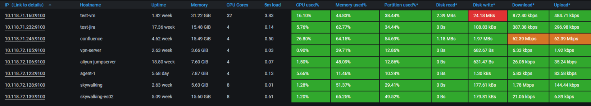
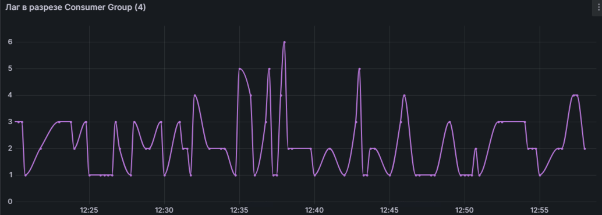
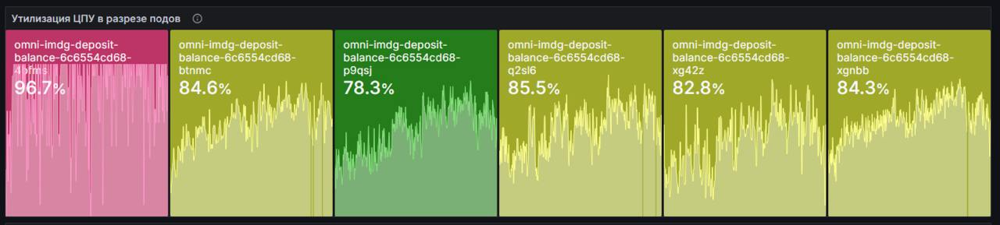
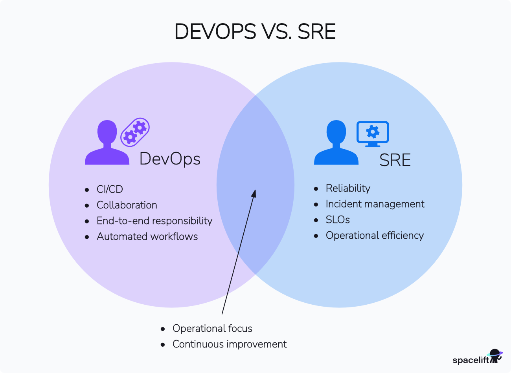

# backend-is-also-beautiful

В данном репозитории расположены материалы для доклада "Backend - это тоже красиво".

## Об авторе

Меня зовут Ваганов Вадим, я руководитель разработки и Head of Profession Backend в Газпромбанке.
Я обожаю делиться опытом, а также обучать и приносить пользу другим. Все мои доклады я строю на своих личных
историях, так что этот будет таким же. Если тебе понравится доклад и ты захочешь ознакомиться с другим моим
контентом - приглашаю в [мой телеграм-канал](https://t.me/vaganov_vadim). Погнали!


## Проблема: что делать, если есть трудности с презентацией и оценкой своей работы

Фронтэндерам и мобильщикам чуть проще в начале пути разработчика, чем бэкендерам: они могут нарисовать красивую
кнопочку, сделать что-то
визуальное, даже если логика проста, то визуал можно "продать" - банально это можно показать друзьям.

```text
ТЫ СДЕЛАЛ ЧТО-ТО ИЗ НИЧЕГО? ДА ТЫ ПРОСТО БОГ! ГДЕ ЭТОМУ НАУЧИТЬСЯ?
```


А бэкендерам что показать? Как в консольку выводим циферки?


```text
Ты правда делал это целую неделю? Может, стоит заняться чем-то покруче?
```


Ладно, это скорее шутка (хоть и с долей правды), но проблема демонстрации результатов своей работы бэкендерам правда
есть - коллеге, боссу, бизнесу, да самому себе, в конце концов.

Решение есть - метрики, визуализация, мониторинг.

И, как оказалось, многими эта тема недооценена. Часто бывает, что люди ничем кроме логов не пользуются. Не
допускайте эту ошибку!

**Обещание:**
дам вам мотивацию погрузиться в мониторинг, объясню, почему стоит потратить время на его изучение, и почему благодаря
мониторингу вы станете более крутым инженером!

## Как метрики и мониторинг могут помочь решить эту проблему

Картинка для привлечения внимания :)


**Дисклеймер**: мониторинг - более широкая тема, но сегодня будем говорить в первую очередь про метрики и их
визуализацию.

Я не хочу делать это просто вводным докладом по мониторингу. Но нам нужна база. И базу мы посмотрим на практике. Нам
понадобится всего 5-10 минут, чтобы получить первые результаты.

### Получаем данные о состоянии приложения в моменте времени

Пререквизиты: [Docker](https://github.com/docker), [JDK 17](https://www.oracle.com/java/technologies/javase/jdk17-archive-downloads.html).

Всё придумано до нас, нам нужен простой и понятный инструмент - например, [micrometer](https://micrometer.io/) или
аналог, если у вас не java/kotlin. И интегрируем с /actuator.

По итогу нам нужно в [build.gradle](build.gradle) добавить следующее:

```groovy
implementation 'io.micrometer:micrometer-registry-prometheus'
implementation 'org.springframework.boot:spring-boot-starter-actuator'
```

С концепциями micrometer можно ознакомиться
в [документации](https://docs.micrometer.io/micrometer/reference/concepts.html).
Реализуем простую метрику
в [демо-контроллере](src/main/java/ru/vaganovvadim/backendisalsobeautiful/DemoController.java).

Запускаем приложение

```bash
./gradlew bootRun
```

Проверяем запрос в тестовый контроллер

```bash
curl http://localhost:8080/demo
```

и смотрим на метрики

```bash
curl http://localhost:8080/actuator/prometheus
```

Пока что мы можем получать такую информацию в моменте, но мы хотим историчность, так что это дело надо как-то
получать и где-то хранить.

У нас есть заготовленный конфиг, чтобы поднять [Grafana](https://grafana.com/) и [Prometheus](https://prometheus.io/)

```bash
docker compose -f local/docker-compose.yml up
```

Открываем [UI Prometheus](http://localhost:9090), пробуем найти `demo_requests_total`, нажимаем Execute, проверяем
историчность - она есть!

Теперь мы можем что-то навизуализировать! Открываем нашу [Grafana](http://localhost:3000), вводим креды admin/admin.
Dashboards -> Create Dashboard -> Add visualization. Конфигурируем Data Source: Configure a new data source ->
Prometheus -> Connection = http://prometheus:9090 -> Save & test. Возращаемся к меню Create Dashboard -> Add
visualization, выбираем Data Source `prometheus`. Настраиваем наш дашборд: выбираем Code вместо Builder, пишем `sum
(rate(demo_requests_total[1m]))`. Вы великолепны!

Давайте накидаем ещё запросов, чтобы посмотреть, как это будет выглядеть:

```bash
for i in $(seq 1 1000); do
  curl -sS -o /dev/null http://localhost:8080/demo
done
```

Круто!

Инструментарий готов. Теперь мы можем:

- создавать любые метрики в приложении;
- собирать, хранить и получать метрики за выбранный период;
- визуализировать метрики как душе угодно.

Зачем на всё это нужно?

```text
Без мониторинга вы слепы. Вы не знаете, что происходит с вашим приложением, вы даже не знаете, работает ли фича как вы 
ожидаете.
```

Оч круто! А мониторить-то что?

## Что отслеживать в backend-приложениях

```text
У вас когда-нибудь было состояние, когда вам плохо, болит голова, першит горло, вы думаете, что всё - у вас 38 и вы 
жутко простудились. Берёте градусник, измеряете температуру... А у вас 36.6. Не полагайтесь на ощущения - смотрите в 
мониторинг!
```

### Состояние серверов и инфраструктуры

* Состояние серверов;
* Загруженность дисков;
* Мониторинг сети
* и пр.

Здесь важен, в том числе, анализ долгосрочных тенденций, например,
насколько скоро закончится свободное место при текущем уровне нагрузки.



### Метрики производительность приложения

4 золотых сигнала:

* Latency (Задержка);
* Traffic (Трафик);
* Errors (Ошибки);
* Saturation (Насыщение).

ВАЖНО: иногда ваше приложение начинает работать медленно из-за интеграций, поэтому их тоже
просто необходимо отслеживать. Если провайдер данных отвечает за 1 секунду, а у вас SLA 250 мс, то, как бы 
производительно и надёжно ни было ваше приложение - у вас уже проблемы.






### Бизнес-метрики

И это те метрики, которые совершенно прекрасны, потому что они помогут вам почувствовать себя не просто писателем 
кода, а тем, кто действительно влияет на продукт и бизнес в целом.

Например, можно отслеживать конверсии и ключевые действия: если ваше приложение связано с бизнес-процессами,
важно отслеживать ключевые метрики, например, количество покупок. Это помогает понять, насколько успешно
работает ваше приложение.

Если вы проверяете гипотезы или проводите a/b-тестирование - собирать и визуализировать метрики просто обязательно.


```text
Красиво - это не только про визуал. Получать обратную связь и взаимодействовать с системой/продуктом - тоже красиво :)
```

## Почему мониторинг — это навык, который стоит прокачать любому инженеру



**Мониторинг как важная составляющая DevOps и SRE практик**: современные инженеры всё чаще сталкиваются с задачами,
которые выходят за рамки чистой разработки кода. Инженеры должны не только писать код, но и понимать, как этот код
работает в реальных условиях. Это не только сделает вас более компетентными, но и придаст новый интерес работе.

**Взаимодействие мониторинга с процессами CI/CD**: изменения - наше всё, именно благодаря им мы приносим пользу
бизнесу - улучшаем пользовательский опыт, проверяем гипотезы, зарабатываем деньги. Мониторинг помогает убедиться, что
новые
изменения работает как задумано, а также не приводят к ухудшению производительности или стабильности системы.
Интеграция мониторинга в CI/CD позволяет быстро выявлять проблемы и откатывать изменения, если что-то пошло не так.

**Универсальный и вечнозелёный навык**: на каком бы стэке вы не работали, чем бы не занимались в backend-разработке,
уверяю вас, что это тот навык, который будет полезен на протяжении всей карьеры.

**Важность анализа данных о вашем продукте**: важные решения принимаются на основе
данных, без грамотного отслеживания метрик и их визуализации вы будете просто подбрасывать монетку.

**Возможность предвидеть и предотвращать проблемы**: успешные инженеры могут не только решать проблемы, но и
предотвращать их. Мониторинг позволяет выявлять аномалии и потенциальные угрозы до того, как они приведут к сбоям.

## Подведение итогов

```text
Метрики - это то что ты хочешь смотреть не только когда плохо, но и когда хорошо. АУФ
```

Мониторинг — это не просто инструмент, это философия. Это способ мышления, который помогает вам быть в курсе того, что
происходит с вашей системой, и принимать обоснованные решения.

```text
    Мониторинг делает вас более уверенным инженером. Когда вы знаете, что происходит с вашим приложением, вы можете спокойно спать по ночам, зная, что система под контролем.

    Мониторинг помогает вам расти. Это навык, который будет полезен не только в вашей текущей работе, но и в будущем. Чем раньше вы начнёте погружаться в эту тему, тем быстрее вы станете более востребованным специалистом.

    Мониторинг — это инвестиция в стабильность и качество. В конечном итоге, это то, что делает ваше приложение надёжным, а вашу команду — эффективной.

    Мониторинг — это просто эстетически красиво. Когда наглядно видишь тонкости работы приложения — это совершенно новый уровень погружения в работу.
```

Так что, если вы ещё не начали заниматься мониторингом, самое время начать. У вас есть все инструменты и все
возможности, вы можете скачать этот репозиторий и начать прямо сейчас.

Если у вас остались вопросы или вы хотите обсудить тему мониторинга более подробно, я всегда рад пообщаться.
Спасибо за внимание!

## Полезные источники

* [Официальная дока Micrometer](https://docs.micrometer.io/micrometer/reference/)
* [Официальная дока Prometheus](https://prometheus.io/docs/introduction/overview/)
* [Официальная дока Grafana](https://grafana.com/docs/grafana/latest/dashboards/)
* [4 золотых сигнала](https://sre.google/sre-book/monitoring-distributed-systems/)
* [Книга об SRE](https://www.piter.com/product/site-reliability-engineering-nadezhnost-i-bezotkaznost-kak-v-google)
