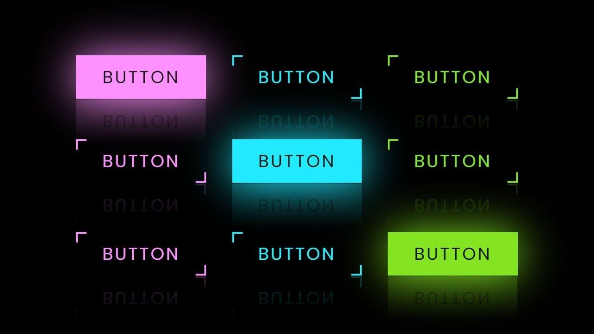

# backend-is-also-beautiful

Материалы для доклада "Backend - это тоже красиво"

## Об авторе

Меня зовут Ваганов Вадим, я руководитель разработки и Head of Profession Backend в Газпромбанке.
Я обожаю делиться опытом, а также обучать и приносить пользу другим. Все мои доклады я строю на своих личных 
историях, так что этот будет таким же. Если тебе понравится доклад и ты захочешь ознакомиться с другим моим 
контентом - приглашаю в [мой телеграм-канал](https://t.me/vaganov_vadim). Погнали!

## Проблема: что делать, если есть трудности с презентацией и оценкой своей работы

Фронтэндерам и мобильщикам чуть проще в начале пути разработчика, чем бэкендерам: они могут нарисовать красивую 
кнопочку, сделать что-то 
визуальное, даже если логика проста, то визуал можно "продать" - банально это можно показать друзьям.


> ТЫ СДЕЛАЛ ЧТО-ТО ИЗ НИЧЕГО? ДА ТЫ ПРОСТО БОГ! ГДЕ ЭТОМУ НАУЧИТЬСЯ?




А бэкендерам что показать? Как в консольку выводим циферки?


> Ты правда делал это целую неделю? Может, стоит заняться чем-то покруче?


Ладно, это скорее шутка (хоть и с долей правды), но проблема демонстрации результатов своей работы бэкендерам правда 
есть - коллеге, боссу, бизнесу, да самому себе, в конце концов.

Решение есть - метрики, визуализация, мониторинг.

И, как оказалось, многими эта тема недооценена. Часто бывает, что люди ничем кроме логов не пользуются. Не
допускайте эту ошибку!

**Обещание:**
дам вам мотивацию погрузиться в мониторинг, объясню, почему стоит потратить время на его изучение, и почему благодаря 
мониторингу вы станете более крутым инженером!

## Как метрики и мониторинг могут помочь решить эту проблему


**Дисклеймер**: мониторинг - более широкая тема, но сегодня будем говорить в первую очередь про метрики и их
визуализацию.

Я не хочу делать это просто вводным докладом по мониторингу. Но нам нужна база. И базу мы посмотрим на практике. Нам 
понадобится всего 5-10 минут, чтобы получить первые результаты.

### Получаем данные о состоянии приложения в моменте времени

Всё придумано до нас, нам нужен простой и понятный инструмент - например, [micrometer](https://micrometer.io/) или 
аналог, если у вас не java/kotlin. И интегрируем с /actuator.

По итогу нам нужно в [build.gradle](./build.gradle) добавить следующее:
```groovy
implementation 'io.micrometer:micrometer-registry-prometheus'
implementation 'org.springframework.boot:spring-boot-starter-actuator'
```


Инструментарий готов. Теперь мы можем:
- создавать любые метрики в приложении;
- собирать, хранить и получать метрики за выбранный период;
- визуализировать метрики как душе угодно.

Оч круто! А мониторить-то что?

## Что отслеживать в backend-приложениях

> Без мониторинга вы слепы. Вы не знаете, что происходит с вашим приложением, вы даже не знаете, работает ли фича 
как вы 
ожидаете.


## Почему мониторинг — это навык, который стоит прокачать любому инженеру

## Подведение итогов

> Метрики - это то что ты хочешь смотреть не только когда плохо, но и когда хорошо. АУФ

## Попробовать поиграться локально


```bash
docker compose -f local/docker-compose.yml up
```

```bash
./gradlew bootRun
```

```bash
for i in $(seq 1 1000); do
  curl -sS -o /dev/null http://localhost:8080/demo
done
```

Открыть http://localhost:3000
